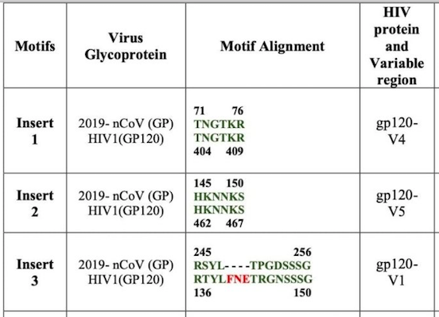

= Reconstruction of Pradhan alignment

https://www.biorxiv.org/content/10.1101/2020.01.30.927871v1

= Methods

All sequences from the Pradhan supplementary material XLS were retrieved.

----
country;Accesion ID;Subtype;Insert
Thailand;AFU28737.1;CRF01_AE;Insert 1
Thailand;AFU28711.1;CRF01_AE;Insert 1
Thailand;AFU28717.1;CRF01_AE;Insert 1
Thailand;AFU28733.1;CRF01_AE;Insert 1
Thailand;AFU28693.1;CRF01_AE;Insert 1
Thailand;AFU28721.1;CRF01_AE;Insert 1
Thailand;AFU28699.1;CRF01_AE;Insert 1
Thailand;AFU28729.1;CRF01_AE;Insert 1
Thailand;AFU28705.1;CRF01_AE;Insert 1
Thailand;AFU28725.1;CRF01_AE;Insert 1
   Kenya;ALB06757.1;G       ;Insert 2
   India;ACL98861.1;C       ;Insert 3
   India;ACL98864.1;C       ;Insert 3
   India;ACL98860.1;C       ;Insert 3
   India;ACL98859.1;C       ;Insert 3
   India;AKR75206.1;C       ;Insert 4
----

The sequence of http://people.biology.ucsd.edu/satish/Science/MePapers/korber.pdf[HXB2] was added to map V1-V5 loops to MSA. Additional PDB sequences for later structural mapping are also added.

Using 

----
muscle -in allseqs.fa -out allseqs.afa
----

a multiple sequence alignment (MSA) was generated. 

[TIP]
====
Use EBIs online version of muscle to reconstruct the MSA at https://www.ebi.ac.uk/Tools/msa/muscle/.
====

[TIP]
====
Use Jalview to visualize MSA https://www.jalview.org/
====

= Results

The following MSA was generated and annotated with V-loops.

See file seqs.afa for aligment in FASTA format.

- red boxes are V-Loops (V1-V5)
- green boxes are found Pradhan insert patterns
- in V1-loop there are no amino acids from India
- Indian gp120 sequences were only partial sequences

= Conclusions (preliminary)

- no insert from India in V1 possible, since no AAs for India seqs available (partial seqs, 230 aa long) 
- Insert1 and Insert3 are *BOTH* in V4 (not V1,V4 seperately)
- Insert2 could be confirmed to be in V5
