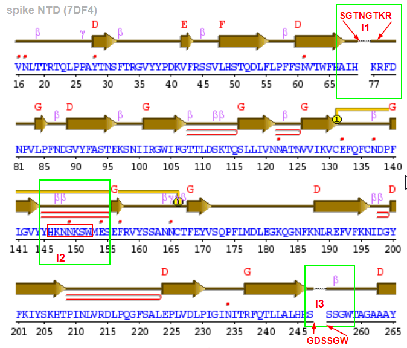
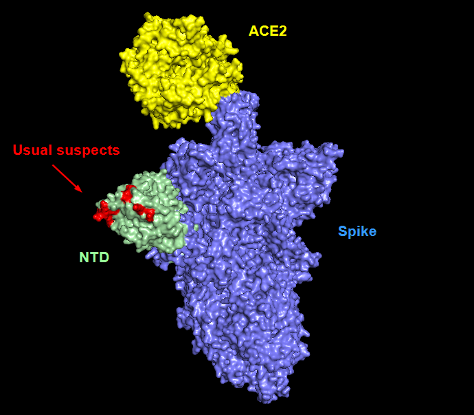
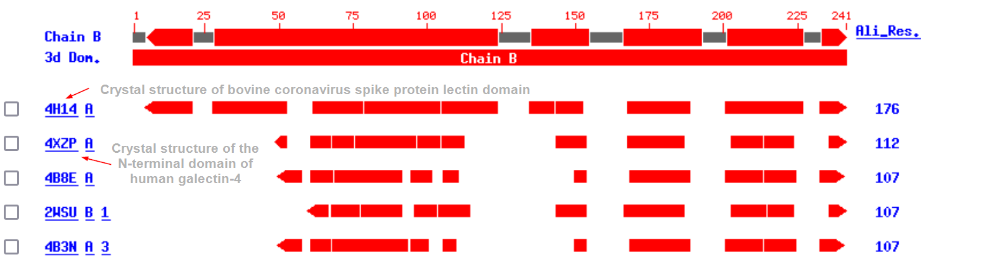
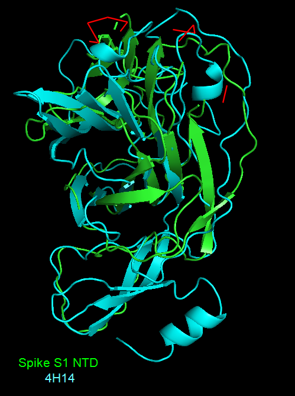

= Spike N-terminal domain analysis

== Overview

The N-terminal domain (NTD) of spike was extracted from the PDB structure https://www.rcsb.org/structure/7df4[7DF4] (see `spike-ntd.fa`)

.Spike NTD sequence (lower-cased residues are inserts)
----
>7df4_NTD_filled
QCVNLTTRTQLPPAYTNSFTRGVYYPDKVFRSSVLHSTQDLFLPFFSNVTWFHAIHsgtngtkrKRFDNPVLPFND
GVYFASTEKSNIIRGWIFGTTLDSKTQSLLIVNNATNVVIKVCEFQFCNDPFLGVYYhknnkSWMESEFRVYSSAN
NCTFEYVSQPFLMDLEGKQGNFKNLREFVFKNIDGYFKIYSKHTPINLVRDLPQGFSALEPLVDLPIGINITRFQT
LLALHRyltpgdSSSGWTAGAAAYYVG
----

The structure of the NTD was extracted from the PDB file (see `spike-ntd.pdb`).

According to http://www.ebi.ac.uk/thornton-srv/databases/cgi-bin/pdbsum/GetPage.pl?pdbcode=7df4&template=protein.html&l=2&chain=C&r=wiring[PDBsum] the domain layout is as follows

.Layout of NTD. Missing residues of loop inserts (I1,I3) are added. Red dots indicate AAs that have contacts with ligands (like NAG sugar in pdb structure).

To better spatially locate the NTD in relation to the ACE2 receptor binding site of spike the following pymol view can be used

.Spatial overview of NTD (greenish), spike body (blue) and bound cognate receptor ACE2 (yellow). Loops with inserts (I1-I3) are red. Note: the full loops is not visible due to missing electron density in the pdb structure.

== Searching for similar domains in PDB

Using the structure of NTD extracted from 7DF4 one can search for similar structures (according to spatial arrangement of secondary structure elements) using https://www.ncbi.nlm.nih.gov/Structure/VAST/vastsearch.html[VAST search].

This gives us the following hits

.Top VAST hits

where the top hit is the lectin domain (PDB:  https://www.rcsb.org/structure/4H14[4H14], https://www.ncbi.nlm.nih.gov/labs/pmc/articles/PMC3516740/[paper]) of a bovine coronavirus with sugar-binding functionality.

Superposition of both domains has an RMSD of Calpha atoms of 0.98 Angstrom over 157 residues, which is quite good.

.Superimposition of Spike NTD and bovine COV lectin domain. Usual suspect loops in red.

The paper compares bovine and murine spike COV NTDs and we can map transitively their alignments (and analysis) to the SC2 spike NTD domain.

image::images/bcov-ntd-sars-cov-2-ntd.jpg[]
