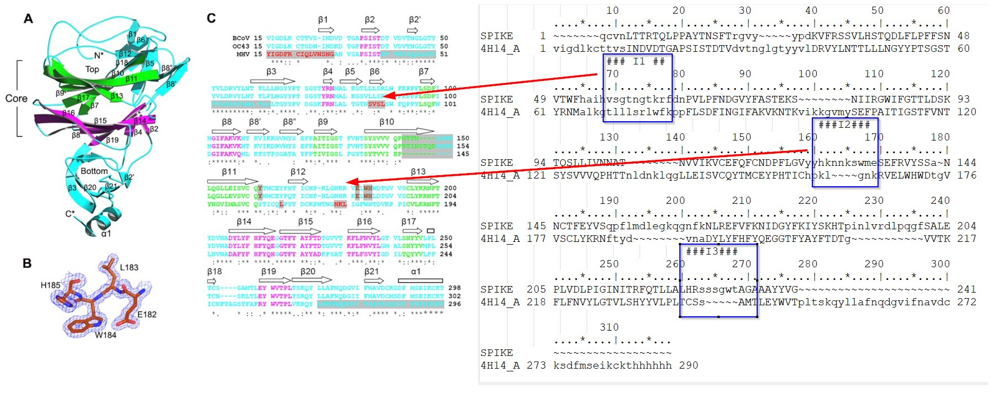

= Spike N-terminal domain analysis

== Overview

The N-terminal domain (NTD) of spike was extracted from the PDB structure https://www.rcsb.org/structure/7df4[7DF4] (see `spike-ntd.fa`)

.Spike NTD sequence (lower-cased residues are inserts)
----
>7df4_NTD_filled
QCVNLTTRTQLPPAYTNSFTRGVYYPDKVFRSSVLHSTQDLFLPFFSNVTWFHAIHsgtngtkrKRFDNPVLPFND
GVYFASTEKSNIIRGWIFGTTLDSKTQSLLIVNNATNVVIKVCEFQFCNDPFLGVYYhknnkSWMESEFRVYSSAN
NCTFEYVSQPFLMDLEGKQGNFKNLREFVFKNIDGYFKIYSKHTPINLVRDLPQGFSALEPLVDLPIGINITRFQT
LLALHRyltpgdSSSGWTAGAAAYYVG
----

The structure of the NTD was extracted from the PDB file (see `spike-ntd.pdb`).

According to http://www.ebi.ac.uk/thornton-srv/databases/cgi-bin/pdbsum/GetPage.pl?pdbcode=7df4&template=protein.html&l=2&chain=C&r=wiring[PDBsum] the domain layout is as follows

.Layout of NTD. Missing residues of loop inserts (I1,I3) are added. Red dots indicate AAs that have contacts with ligands (like NAG sugar in pdb structure).

To better spatially locate the NTD in relation to the ACE2 receptor binding site of spike the following pymol view can be used

.Spatial overview of NTD (greenish), spike body (blue) and bound cognate receptor ACE2 (yellow). Loops with inserts (I1-I3) are red. Note: the full loops is not visible due to missing electron density in the pdb structure.
image::images/spike-suspects.png[]

== Searching for similar domains in PDB

Using the structure of NTD extracted from 7DF4 one can search for similar structures (according to spatial arrangement of secondary structure elements) using https://www.ncbi.nlm.nih.gov/Structure/VAST/vastsearch.html[VAST search].

This gives us the following hits

.Top VAST hits
image::images/vast-result.png[]

where the top hit is the lectin domain (PDB:  https://www.rcsb.org/structure/4H14[4H14], https://www.ncbi.nlm.nih.gov/labs/pmc/articles/PMC3516740/[paper]) of a bovine coronavirus with sugar-binding functionality.

Superposition of both domains has an RMSD of Calpha atoms of 0.98 Angstrom over 157 residues, which is quite good.

.Superimposition of Spike NTD and bovine COV lectin domain. Usual suspect loops in red.

The paper compares bovine and murine spike COV NTDs and we can map transitively their alignments (and analysis) to the SC2 spike NTD domain.

== Superposition of MHV, SarsCov2, SarsCov1, bCOV NTD domains

.Superposition of SC2, SC1, bovine COV, murine COV NTD lectin domains

Lower part with beta-sheets is well conserved and upper part with contact to CEACAM receptor has more variability, due to differing receptor specificity.

.SC2 and MHV NTD domains in contact with CEACAM receptor (ACE2 binding for reference)

For the murine NTD the crystal structure https://www.rcsb.org/structure/3R4D[3R4D] was used and for the Sars Cov2 NTD the structure  https://www.rcsb.org/structure/7DF4[7DF4].

== Sugars and specificity

The https://www.ncbi.nlm.nih.gov/labs/pmc/articles/PMC3127895/[paper] by Fang Li concludes:

[quote,Fang Li]
____
It seems that viruses use a common evolutionary strategy by acquiring host proteins and evolving them into viral RBDs with different receptor specificity. This strategy allows viruses to explore novel cellular receptors and expand their host ranges. The current study provides critical structural information that illustrates how coronaviruses have successfully used this strategy.
____

Other notable quotes are:

[quote,Fang Li]
____
In protein-protein interactions, hydrophobic interactions contribute more to binding energy, whereas hydrophilic interactions contribute more to binding specificity. The above key hydrogen bonds between NTD side chains and the receptor main chain help bring the adjacent hydrophobic patches into place. These structural analyses suggest that the hydrophobic patches and additional polar interactions provide significant binding energy and specificity to MHV-NTD/mCEACAM1a binding interactions.
____

[quote,Fang Li]
____
HCoV-OC43 and BCoV spike proteins recognize cell-surface components containing N-acetyl-9-O-acetylneuraminic acid (Neu5,9Ac2)
____

[quote,Fang Li]
____
TGEV spike protein recognizes N-glycolylneuraminic acid (Neu5Gc) and N-acetylneuraminic acid (Neu5Ac), and such sugar-binding activities are required for the enteric tropism of TGEV (9). PRCoV spike protein, an NTD-deletion mutant of TGEV spike protein, fails to bind sugars, and hence PRCoV has respiratory tropism only 
____

[quote,Fang Li]
____
Therefore, through evolution MHV-A59 appears to have optimized many of its interactions with mCEACAM1a, and thus substitutions in MHV NTD that disrupt these specific molecular interactions weaken or abrogate viral infectivity.
____

[quote,Fang Li]
____
Our study provides the structural basis for the viral and host specificities of coronavirus/CEACAM1 interactions. On the basis of structural analyses and mutagenesis data, we determined that MHV NTD contains Arg20, Ile22, Asn26, and Tyr162, all of which form energetically favorable interactions with mCEACAM1a, whereas other group 2a coronavirus NTDs contain residues at the corresponding positions that are expected to disrupt critical hydrophobic or polar interactions with mCEACAM1a
____

[quote,Fang Li]
____
Results showed that NTDs of HCoV-OC43 and BCoV bound sugars, whereas NTDs of MHV-A59, HCoV-HKU1, and SARS-CoV did not
____

[quote,Fang Li]
____
Why do the NTDs of HCoV-OC43 and BCoV, but not that of MHV, bind sugars, and where is the sugar-binding site located in coronavirus NTDs? In human galectin-3 that binds galactose, the sugar-binding site (site A) is located above the β-sandwich core and involves the 10–11 loop (loop connecting β10 and β11) 
____

[quote,Fang Li]
____
However, compared with human galectin-3, MHV NTD has a markedly shortened 10–11 loop that may be responsible for its lack of lectin activity. HCoV-OC43 and BCoV NTDs likely share the same galectin fold as MHV NTD due to their high sequence similarities (Fig. S1), but they both contain longer 10–11 loops than MHV NTD (Fig. 3B and Fig. S3) and thus may use site A for sugar binding. 
____

[quote,Fang Li]
____
How did coronavirus spike NTDs originate and evolve? We propose that an ancestral coronavirus acquired a galectin-like domain from its host. Subsequently, an ancestral group 2a coronavirus incorporated a HE gene into its genome to aid viral detachment from sugars on infected cells. Later, the galectin-like NTD of MHV evolved additional novel structural elements that allowed it to bind mCEACAM1a. Using a protein receptor instead of sugar receptors greatly enhanced the attachment affinity between MHV and murine cells, making sugar-binding functions dispensable. Accordingly, MHV-A59 underwent changes in the sugar-binding site of its NTD, lost its sugar-binding activity, and stopped expressing its HE gene. In contrast, the galectin-like NTDs of some contemporary coronaviruses such as HCoV-OC43, BCoV, and TGEV retain the lectin activity, although their sugar specificities have diverged in three coronavirus groups and differ from those of contemporary human galectins. 
____

